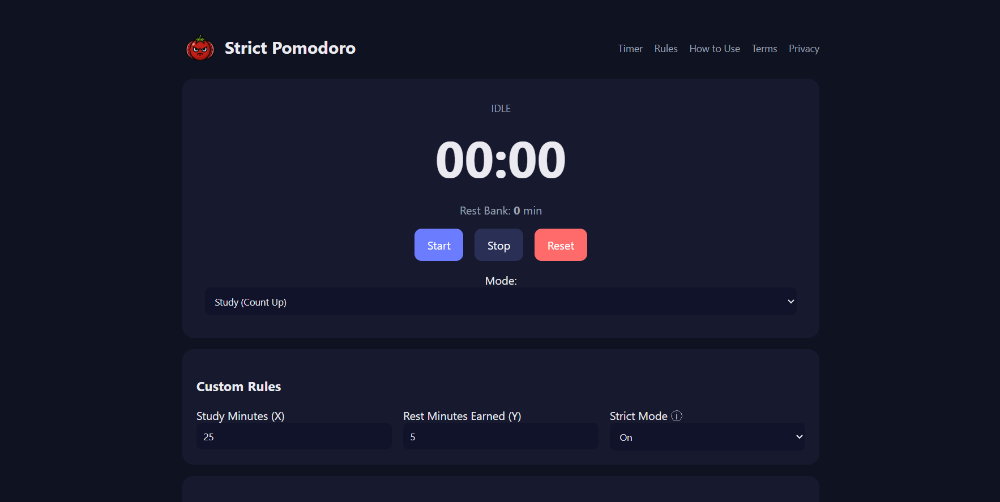

# Strict Pomodoro

**Strict Pomodoro** is a free, web-based timer designed to help you focus on study sessions and track earned rest time. It’s simple, no-login required, and fully customizable.

**Link:** https://dionsrm.github.io/strict-pomodoro/

  

---

## Features

- Study mode counts **up continuously**, every X minutes studied earns Y rest minutes.  
- Rest mode consumes your accumulated rest bank.  
- **Strict mode**: stopping early in study mode forfeits earned rest.  
- Fully **customizable** study and rest durations.  
- **Progress tracking** with visual indicators.  
- Keyboard shortcuts for quick control.  
- Optional focus lock and sound toggle.  
- All data stored locally in your browser — **no accounts, no tracking**.

---

## How to Use

1. Open the website in your browser.
2. Set your **study target** (X minutes) and **rest earned** (Y minutes).  
3. Select **Study** mode to start your session.  
4. Study until you hit your target; rest minutes accumulate automatically.  
5. Switch to **Rest** mode to consume your earned rest.  
6. Use the controls or keyboard shortcuts to start, stop, or reset.

---

## Keyboard Shortcuts

- `Space` → Start/Stop timer  
- `B` → Reset timer  
- `S` → Study mode
- `R` → Rest mode  
*(Add more if you’ve implemented them.)*

---

## Donate / Support

If you find **Strict Pomodoro** useful, consider supporting development:

Every donation helps keep this project free and ad-free.

---

## License

All rights reserved © 2026 dionsrm.  
Use responsibly. The timer is provided "as-is" — no warranties for productivity outcomes.

---

## Notes

- Works in all modern browsers.  
- Data (rules, timer progress) stored in `localStorage` in your browser.  
- No analytics, tracking, or cookies used.
